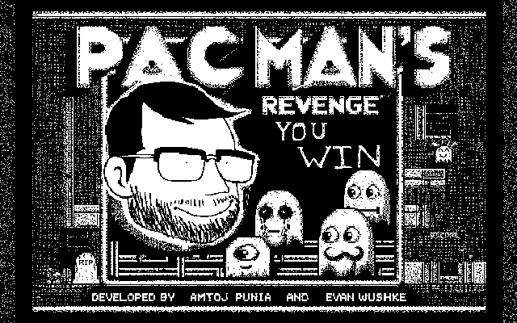

# Detailed Game Specification: Pacman’s Revenge

**Course:** COMP 2659 Winter 2024  
**Instructor:** Marc Schroeder  
**Author(s):** Amtoj Punia and Evan Wushke  
**Last Modified:** April 8th, 2024  

## 1. General Game Overview

Pacman wants to get revenge on the ghosts that have tormented him for years; however, he only has the strength to take on one ghost at a time.  
Your main objective is to corner and eat all of the ghosts without getting overpowered.

## 2. Game Play Details for Core 1-Player Version

### Objectives and Rules

- Pacman Starts in the lower center of the map ghosts will start in the center and branch off to their respective static paths. There is a visible timer which will start at 99 and will increase in seconds.  
- The objective is to eat all the ghosts. Ghosts will not change their behavior unless Pacman reaches a certain proximity to one of them. Once Pacman is close to a ghost it will attempt to run to the farthest corner of the map relative to its current location. Once the ghost reaches the corner, if Pacman is still in the ghost's proximity it will freeze; if Pacman is not there, it will continue along its default path.  
- Pacman can move in four directions; up, left, down, right. The user will specify a direction using the `W`,`A`,`S`,`D` keys respectively. Pacman moves at a constant velocity. The ghosts have a slower velocity than Pacman in their default state and will have a velocity just slightly slower than pacman  when running away.   
- Ghosts will plot a tombstone if pacman catches up to them, this tombstone will become a part of the map.
- The user can press `ENTER` to respawn, this can only be done when pacman is not moving. This was added to avoid softlocking.
- Final score has not been implemented, there is only a win or loose condition.
### Win Condition

- The player wins if they manage to eat all 4 ghosts within the allotted time (99 seconds).

### Lose Condition

- If the player cannot eat the ghosts within 99 seconds the player looses.
### Objects
- **Map:** represented as a 2D `Cell` array that represents the map.
    
    - **Path** (light blue) cell for entities to move freely
    - **Wall** (black) Physical barrier no entities can pass through
    - **Invisible Wall** (white) Destination for ghosts when running
    - **Occupied Region** (Red) Represents 4 cells which are currently occupied by an entity.
    - **Hotspot** (Dark blue) As a cell attribute this is represented by `x` and `y`.
### Structs
- `Entity`: Structure that encapsulates the model.
- `Pacman`: 
```typedef struct 
{
	int current_frame;		        /* current sprite (state) index */
	UCHAR8 state;					/*DEFAULT OR EVIL*/
	ObjectType type;
	Movement* move;
}Pacman; 
```
- `Cell`: A structure made to represent a single region of the map, cells are relative to every 16 pixels.
- `Movement`: Used as a generic atribute between `Ghost` and `Pacman` types. Movements consist of anything relating to an objects motion, i.e `x`, `y`, `delta_x`, `direction`, etc.
- **Ghost (Default):** 4 Ghost Entities.
    - 4 Sprites per ghost in default state matching direction.
    - Position (integer pair)
    - Path (individual to each ghost instance)
    - Traversal ±1 in row or column position per in-game clock cycle

- **Ghost (Running):** 
    - Position 
    - Path (Current location to farther corner from current position)
    - Traversal ±2 in row or column position per in-game clock cycle
    - Constant velocity of 72 pixels per second

- **Ghost (Freeze):** 
    - Position
    - Shivering animation but no change in position vector

- **Pacman (Default):** 
    - Position (integer pair)
    - Velocity (signed integer pair)
    - Hitbox (±3 in row/column vector)
    - Traversal ±1 in row or column position per in-game clock cycle. 
    - Constant velocity of pixels per second

- **Pacman (Engraged):** Same as default Pacman

- **Tombstone:** Generates when Pacman eats a ghost at that specific location. Static once placed, does not interact with any entity.

### Physics

- There is collision detection in this game as there is a maze that Pacman and the ghosts have to follow so there are walls surrounding him. This is to stop the objects from moving through the game environment.
- The velocity for the object is constant (i.e., Pacman always moves at a constant speed). The ghosts can, however, move at a faster speed (when triggered) and it's just the base constant (64 pixels/second + 8 pixels/second) = 72 pixels/second.

### Asynchronous (Input) Events

- **Move down:** ‘↓’ key is pressed. Changes Pacman's direction to down.
- **Move up:** ‘↑’ key is depressed. Changes Pacman's current direction to ‘up’.
- **Move left:** ‘←’ key is depressed. Changes Pacman's direction to left.
- **Move right:** ‘→’ key is depressed. Changes Pacman's direction to right.

### Synchronous (Timed) Events

- **Pacman moves:** 140 pixels per 70 frames. Pacman moves in the direction specified by the user at the default speed.
- **Ghost moves (default):** 136 pixels per 70 frames. Ghosts have this as their default speed during the whole game.
- **Ghost moves (Running):** 136+n pixels per second (n is just a placeholder for now). When this is triggered, the ghosts will gain speed (adding a constant to default).

### Condition-Based (Cascaded) Events

- **Wall collision:** Hitting a wall on the map. Pacman will stop (delta y = 0 and delta x = 0).
- **Single Proximity:** Pacman gets within a certain proximity of a ghost. A single ghost has entered Pacman's Hitbox. Pacman's sprite and the ghost sprite will change.
- **Timer runs out (Game Over):** Can only occur if the timer reaches 0.
- **All ghosts cleared (Win):** Ghost encounter a corner. Ghost encounters an open location while on its current path. Ghost is killed. Final ghost is eaten. (no ghosts left).

### Hypothetical Gaming Session

In "Pacman's Revenge," the game commences with Pacman positioned at the lower center of the maze with the ghosts originating from the center and moving along their predestined paths. The on-screen timer starts at 99. As Pacman navigates the maze using the W, A, S, or D keys for movement, the ghosts maintain their standard speed until Pacman nears one. This proximity triggers the ghost to flee the opposite directions from Pacman or it picks an optimal direction based upon a direction map that is given to them if they encounter a wall. During this phase, the ghost's speed increases slightly, providing a challenge as Pacman tries to intercept it. Upon successfully cornering and consuming a ghost, the ghost will be cleared and a tombstone is placed in that location. The player maneuvers Pacman to avoid walls and tombstones as these become a part of the environment once a ghost is killed there. This means that there is a slight chance that the player can lock themselves inside a location on the map and not be able to win the game, so they must be strategic about this. The session culminates with the capture of the final ghost, triggering the win screen.

## 3. Game Play Details for Core 2-Player Version

A co-op version of the game with the same mechanics. The only difference is there is a second Pacman on the board controlled by another player. The objective stays the same, and this time both players have to kill all of the ghosts. (Note: This has not been implemented in the game's current version.)

## 4. Sound Effects

- **Pacman Travel Sound:** The classic pacman sound that is made as the game runs on. Triggered any time Pacman has a non-zero velocity.
- **Ghost Eaten Sound:** When Pacman eats a ghost a “power up” type sound will be played. Triggered when Pacman's position matches with a ghost's position.
- **Pacman Intro Sound:** Before the game starts, the classic pacman intro plays with all entities stationary and the game will not start until this intro is finished playing. Triggered when the '1 Player' option is selected and the game begins.

## 5. Additional Features (Time Permitting)

- Powerup pickups
- Color in the maze and the objects
- Intro animation
- Ghosts death animation
- 2 player mode
